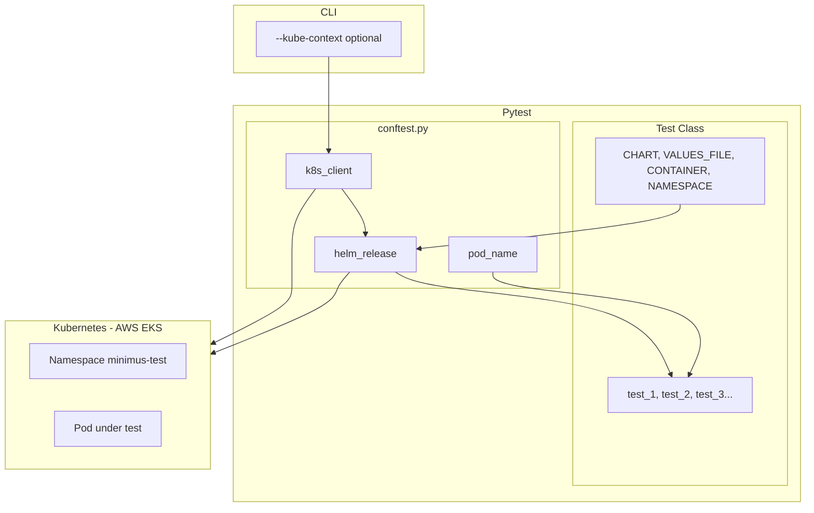

# Minimus Image Validation Framework

Generic Helm-based test infrastructure for validating minimized container images. Currently configured for PostgreSQL; extensible to Redis, MongoDB, or any Bitnami chart.

## Deliverables

| Deliverable | Location |
|-------------|----------|
| Test Plan | [docs/TEST_PLAN.md](docs/TEST_PLAN.md) |
| Test Report | [docs/TEST_REPORT.md](docs/TEST_REPORT.md) |
| Automation (Helm) | [tests/test_postgresql_bugs.py](tests/test_postgresql_bugs.py) |
| Run Instructions | This README |

## Project Structure

```
minimus-assignment/
├── helm-values/                    # Values files (external data)
│   └── postgresql-defective-image-values.yaml
├── tests/
│   ├── conftest.py                 # Generic fixtures (any chart)
│   └── test_postgresql_bugs.py     # PostgreSQL-specific tests
├── docs/
│   ├── TEST_PLAN.md
│   └── TEST_REPORT.md
├── pytest.ini                      # Pytest configuration
└── requirements.txt
```

## Design

Each test class defines its own configuration as class attributes:

```python
class TestPostgreSQLBugs:
    CHART = "bitnami/postgresql"
    VALUES_FILE = "helm-values/postgresql-defective-image-values.yaml"
    CONTAINER = "postgresql"
    NAMESPACE = "minimus-test"
    RELEASE_PREFIX = "pg-test"

    def test_1_pod_becomes_unhealthy(self, helm_release, pod_name, k8s_client):
        ...
```

The only CLI flag is `--kube-context` to select which Kubernetes cluster to use (e.g. AWS EKS).

### Architecture

The diagram below is in [Mermaid](https://mermaid.js.org/) format. **`flowchart TB`** means "flowchart, top-to-bottom". On GitHub (and in editors with Mermaid support) it renders as a picture; in plain text you see the source.



*Flow: CLI context → k8s client; test class config → helm_release → tests; both k8s_client and helm_release talk to the Kubernetes cluster (e.g. AWS EKS).*

## Prerequisites

- **Kubernetes:** Local cluster (Docker Desktop with Kubernetes, Minikube, or Kind).
- **CLI:** `kubectl` and `helm` v3 in PATH; kubeconfig pointing at the cluster.
- **Python:** 3.9+

## Setup

1. **Install Python dependencies**

   ```bash
   pip install -r requirements.txt
   ```

2. **Add Bitnami Helm repo**

   ```bash
   helm repo add bitnami https://charts.bitnami.com/bitnami
   helm repo update
   ```

3. **Ensure cluster is running**

   ```bash
   kubectl cluster-info
   ```

## Run the Test Suite

### Basic Usage

```bash
# Run all tests (uses config from each test class)
pytest

# Run with explicit Kubernetes context
pytest --kube-context=minimus-test

# Run only PostgreSQL tests
pytest tests/test_postgresql_bugs.py --kube-context=docker-desktop
```

### CLI Options

| Option | Default | Description |
|--------|---------|-------------|
| `--kube-context` | (none) | Kubernetes context to use (e.g. `docker-desktop`, `minimus-test`) |

### Setting the Kubernetes context (important)

The cluster you run against depends on your **current kubectl context**. On a new or shared env, the default context may be wrong. Set it **before** tests run:

```bash
# Option 1: Set context via pytest (recommended for automation)
pytest --kube-context=minimus-test

# Option 2: Set context in the shell first, then run pytest
kubectl config use-context minimus-test
pytest
```

With `--kube-context`, the framework runs `kubectl config use-context <name>` once at session start, before any Helm or Kubernetes API calls.

### Kubernetes probes (nice to have for testing)

Tests wait for **pod Ready** (readiness probe). It helps to know how probes interact:

- **Liveness** and **readiness** run **in parallel** from container start — liveness does *not* wait for readiness to succeed. A slow-starting container can be killed by liveness before it ever becomes ready.
- **Startup probe**: if defined, *all other probes are disabled* until the startup probe succeeds. Only then do liveness and readiness start. Use it for slow-starting apps so liveness does not kill the container during startup.

| Probe       | Purpose                    | On failure              |
|------------|-----------------------------|-------------------------|
| liveness   | Is the container running?   | Kubelet kills container |
| readiness  | Ready to receive traffic?   | Pod removed from Service endpoints |
| startup    | Has the app started?        | Kubelet kills container; other probes disabled until it succeeds |

[Kubernetes docs: Configure Liveness, Readiness and Startup Probes](https://kubernetes.io/docs/tasks/configure-pod-container/configure-liveness-readiness-startup-probes/).

## Environment Options

### Option A: Locally (Docker Desktop Kubernetes)

1. **Enable Kubernetes in Docker Desktop**: Settings -> Kubernetes -> Enable Kubernetes -> Apply.

2. **Run tests**:

   ```bash
   pytest --kube-context=docker-desktop
   ```

### Option B: AWS (EKS cluster)

1. **Point kubectl at your EKS cluster**:

   ```bash
   aws eks update-kubeconfig --region <REGION> --name minimus-assignment
   ```

2. **Run tests**:

   ```bash
   pytest --kube-context=<your-eks-context-name>
   ```

## Tests (PostgreSQL)

| Test | What is tested | Expected |
|------|----------------|----------|
| **Test 1** | Pod gets Unhealthy event | Liveness probe failed |
| **Test 2** | Container logs | Contains "Permission denied" |
| **Test 3** | Container logs | Contains "cannot create directory" |
| **Test 4** | Pod Ready condition | Pod never becomes Ready |

## Adding New Tests (e.g., Redis)

Create a new test file with its own class attributes:

```python
# tests/test_redis_bugs.py
class TestRedisBugs:
    CHART = "bitnami/redis"
    VALUES_FILE = "helm-values/redis-defective-image-values.yaml"
    CONTAINER = "redis"
    NAMESPACE = "minimus-test"
    RELEASE_PREFIX = "redis-test"

    def test_1_redis_specific_defect(self, helm_release, pod_name, k8s_client):
        ...
```

No changes to `conftest.py` needed.

## Reference

- **Reference image:** `registry-1.docker.io/bitnami/postgresql:latest`
- **Image under test:** `docker.io/halex1985/postgresql:latest`
