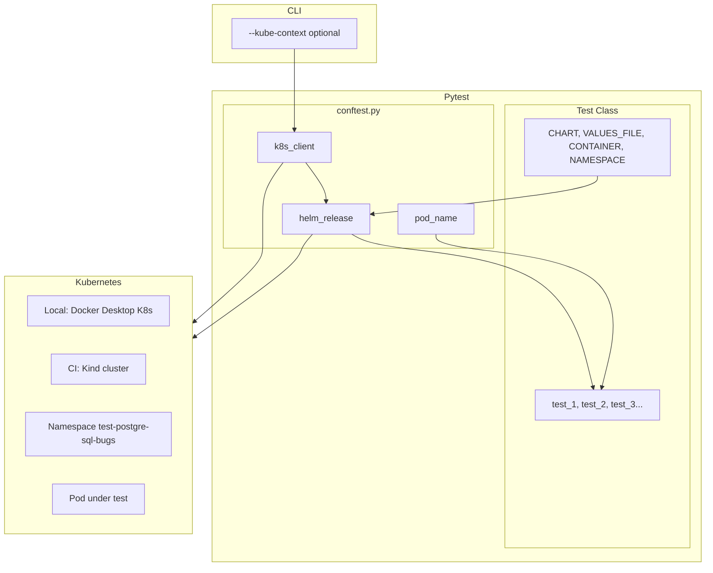

# K8s Helm Image Validation

**Repository:** [github.com/refeali-io/k8s-helm-image-validation](https://github.com/refeali-io/k8s-helm-image-validation)  
**Part of my [automation portfolio](https://github.com/refeali-io)** — K8s API automation that validates custom/minimized container images against Bitnami Helm charts on a real Kubernetes cluster.

Generic Helm-based test infrastructure for validating minimized container images. Currently configured for PostgreSQL; extensible to Redis, MongoDB, or any Bitnami chart.

## Deliverables

| Deliverable | Location |
|-------------|----------|
| Test Plan | [docs/TEST_PLAN.md](docs/TEST_PLAN.md) |
| Test Report | [docs/TEST_REPORT.md](docs/TEST_REPORT.md) |
| Automation (Helm) | [tests/test_postgresql_bugs.py](tests/test_postgresql_bugs.py) |
| Run Instructions | This README |

## Project Structure

```
k8s-helm-image-validation/
├── .github/workflows/
│   └── run-tests.yml               # CI: Kind cluster + pytest
├── helm-values/                    # Values files (external data)
│   └── postgresql-defective-image-values.yaml
├── tests/
│   ├── conftest.py                 # Generic fixtures (any chart)
│   └── test_postgresql_bugs.py     # PostgreSQL-specific tests
├── docs/
│   ├── TEST_PLAN.md
│   ├── TEST_REPORT.md
│   ├── postgresql-under-test-layers.png   # Image-under-test layer diagram (replace with your own if desired)
│   ├── bitnami-postgresql-layers.png
│   └── layers-comparing.png
├── pytest.ini                      # Pytest configuration
└── requirements.txt
```

## Design

Each test class defines its own configuration as class attributes:

```python
class TestPostgreSQLBugs:
    CHART = "bitnami/postgresql"
    VALUES_FILE = "helm-values/postgresql-defective-image-values.yaml"
    CONTAINER = "postgresql"
    NAMESPACE = "k8s-validation-test"
    RELEASE_PREFIX = "pg-test"

    def test_1_pod_becomes_unhealthy(self, helm_release, pod_name, k8s_client):
        ...
```

The only CLI flag is `--kube-context` to select which Kubernetes cluster to use (e.g. AWS EKS).

### Architecture

The diagram below is in [Mermaid](https://mermaid.js.org/) format. **`flowchart TB`** means "flowchart, top-to-bottom". On GitHub (and in editors with Mermaid support) it renders as a picture; in plain text you see the source.



*Flow: CLI context → k8s client; test class config → helm_release → tests; both k8s_client and helm_release talk to the Kubernetes cluster. Locally we use Docker Desktop with built-in Kubernetes; in CI we use Kind. On scaling, the cluster will be raised on AWS (e.g. EKS).*

## Prerequisites

- **Docker Desktop** with Kubernetes enabled (for local development). [Download Docker Desktop](https://www.docker.com/products/docker-desktop/).
- **CLI tools:** `kubectl` and `helm` v3 in PATH.
- **Python:** 3.9+

> **Note:** In CI (GitHub Actions), tests run on a **Kind** cluster. Locally you can use Docker Desktop (with Kubernetes), Kind, or Minikube.

---

## Quick Start

Complete steps to run the tests from scratch on a fresh machine.

### 1. Install Docker Desktop and enable Kubernetes

1. Download and install [Docker Desktop](https://www.docker.com/products/docker-desktop/).
2. Open Docker Desktop → **Settings** → **Kubernetes** → check **Enable Kubernetes** → click **Apply & Restart**.
3. Wait until Docker Desktop shows "Kubernetes is running" (green icon in the bottom-left).

> **Context:** Docker Desktop automatically creates a kubectl context named `docker-desktop`. You do not need to create it manually.

### 2. Install CLI tools

- **kubectl:** [Install kubectl](https://kubernetes.io/docs/tasks/tools/) or use the one bundled with Docker Desktop.
- **Helm v3:** [Install Helm](https://helm.sh/docs/intro/install/) (e.g., `choco install kubernetes-helm` on Windows, `brew install helm` on macOS).

Verify:

```bash
kubectl version --client
helm version
```

### 3. Clone the repository

```bash
git clone <repository-url>
cd k8s-helm-image-validation
```

### 4. Create Python virtual environment

```bash
python -m venv venv

# Windows (PowerShell):
.\venv\Scripts\Activate.ps1

# Linux/macOS:
source venv/bin/activate
```

### 5. Install Python dependencies

```bash
pip install -r requirements.txt
```

### 6. Add Bitnami Helm repo

```bash
helm repo add bitnami https://charts.bitnami.com/bitnami
helm repo update
```

### 7. Verify Kubernetes cluster is running

```bash
kubectl cluster-info
kubectl config current-context   # should show "docker-desktop"
```

### 8. Run the tests

```bash
pytest --kube-context=docker-desktop
```

That's it! The tests will install the Helm chart, run assertions, and clean up.

---

## Setup (Reference)

If you followed the Quick Start, you're done. This section is for reference.

| Step | Command |
|------|---------|
| Create venv | `python -m venv venv` |
| Activate (Windows PowerShell) | `.\venv\Scripts\Activate.ps1` |
| Activate (Linux/macOS) | `source venv/bin/activate` |
| Install deps | `pip install -r requirements.txt` |
| Add Helm repo | `helm repo add bitnami https://charts.bitnami.com/bitnami && helm repo update` |
| Verify cluster | `kubectl cluster-info` |

## Run the Test Suite

### Basic Usage

```bash
# Run all tests (uses config from each test class)
pytest

# Run with explicit Kubernetes context (same as in Quick Start step 8)
pytest --kube-context=docker-desktop

# Run only PostgreSQL tests
pytest tests/test_postgresql_bugs.py --kube-context=docker-desktop
```

### CLI Options

| Option | Default | Description |
|--------|---------|-------------|
| `--kube-context` | (none) | Kubernetes context to use (e.g. `docker-desktop` locally, `kind-k8s-validation-test` in CI) |

### Setting the Kubernetes context (important)

The cluster you run against depends on your **current kubectl context**. Use the same context you set up in the Quick Start (e.g. `docker-desktop` for local). If the default context is wrong, set it before tests run:

```bash
# Option 1: Set context via pytest (recommended for automation)
pytest --kube-context=docker-desktop

# Option 2: Set context in the shell first, then run pytest
kubectl config use-context docker-desktop
pytest
```

With `--kube-context`, the framework runs `kubectl config use-context <name>` once at session start, before any Helm or Kubernetes API calls.

**Allure:** Pytest is configured in `pytest.ini` to write Allure results to `allure-results/` (`--alluredir=allure-results --clean-alluredir`). In CI, results are uploaded and the report is published to GitHub Pages. Locally, install the [Allure CLI](https://allurereport.org/docs/getting-started/installation/) and run `allure serve allure-results` after `pytest` to view the report in the browser.

### Kubernetes probes (nice to have for testing)

Tests wait for **pod Ready** (readiness probe). It helps to know how probes interact:

- **Liveness** and **readiness** run **in parallel** from container start — liveness does *not* wait for readiness to succeed. A slow-starting container can be killed by liveness before it ever becomes ready.
- **Startup probe**: if defined, *all other probes are disabled* until the startup probe succeeds. Only then do liveness and readiness start. Use it for slow-starting apps so liveness does not kill the container during startup.

| Probe       | Purpose                    | On failure              |
|------------|-----------------------------|-------------------------|
| liveness   | Is the container running?   | Kubelet kills container |
| readiness  | Ready to receive traffic?   | Pod removed from Service endpoints |
| startup    | Has the app started?        | Kubelet kills container; other probes disabled until it succeeds |

[Kubernetes docs: Configure Liveness, Readiness and Startup Probes](https://kubernetes.io/docs/tasks/configure-pod-container/configure-liveness-readiness-startup-probes/).

## Environment Options

### Locally (Docker Desktop, Kind, or Minikube)

You can run the tests against any local Kubernetes cluster. Use the **Quick Start** above for full setup steps; the only difference is which context you pass to pytest.

| Option | Context name | Notes |
|--------|--------------|--------|
| **Docker Desktop** (K8s built-in) | `docker-desktop` | Enable in Settings → Kubernetes. Context is created automatically. |
| **Kind** | `kind-<cluster-name>` (e.g. `kind-k8s-validation-test`) | Create a cluster with `kind create cluster [--name <name>]`. |
| **Minikube** | `minikube` | Start with `minikube start`. Context is created automatically. |

After your cluster is running, use the context from the table:

```bash
pytest --kube-context=docker-desktop    # or kind-k8s-validation-test, minikube, etc.
```

### GitHub Actions (CI)

The pipeline [.github/workflows/run-tests.yml](.github/workflows/run-tests.yml) runs the same tests in CI using a **Kind** (Kubernetes in Docker) cluster, then publishes an **Allure** report to **GitHub Pages**. No AWS or EKS.

**Triggers:** Push or pull request to **main** (excluding `README.md`-only changes), or manual **workflow_dispatch**.

**Job 1 – Run QA Tests**

1. **Checkout** — repository is cloned on a fresh Ubuntu runner (Docker is already installed).
2. **Create Kind cluster** — [helm/kind-action](https://github.com/marketplace/actions/kind-cluster) creates a cluster with a fixed name (`KIND_CLUSTER_NAME`, default `k8s-validation-test`). The kubeconfig context is `kind-<name>` (e.g. `kind-k8s-validation-test`).
3. **Python & deps** — virtualenv and `pip install -r requirements.txt` (includes `allure-pytest`).
4. **Helm** — Helm CLI is installed; Bitnami repo is added.
5. **Run tests** — `pytest --kube-context=kind-<name>` runs against the Kind cluster. Pytest is configured in `pytest.ini` to write Allure data to `allure-results/` (`--alluredir=allure-results --clean-alluredir`). The test class installs the chart, runs assertions, and uninstalls.
6. **Upload Allure results** — the `allure-results/` directory is uploaded as an artifact (`if: always()` so it runs even if tests fail). Retention: 3 days.

**Job 2 – Deploy Allure Report to Pages** (runs after the test job, `if: always()`)

1. **Checkout** (with `fetch-depth: 0` for history).
2. **Download Allure results** — artifact from the test job.
3. **Install Allure CLI** — Java + [Allure 2.35.1](https://github.com/allure-framework/allure2/releases) so we can generate the HTML report.
4. **Restore history from gh-pages** — if the `gh-pages` branch already has a `history/` directory, it is copied into `allure-results/history` so the new report keeps trend history.
5. **Generate Allure Report** — `allure generate allure-results --clean -o allure-report`.
6. **Deploy to GitHub Pages** — [peaceiris/actions-gh-pages](https://github.com/peaceiris/actions-gh-pages) publishes `./allure-report` to the **gh-pages** branch. The report is then available at `https://<owner>.github.io/<repo>/`.
7. **Comment PR with Allure Report link** — on `pull_request` events, a comment is added to the PR with the report URL.
8. **Add Action Summary** — the run summary in the Actions tab includes the report link.

**One-time setup:** In the repository **Settings → Pages**, set **Source** to “Deploy from a branch” and choose branch **gh-pages** (folder `/ (root)`). The first successful run of the deploy job will create the branch and the report URL.

**To change the cluster name:** set the `KIND_CLUSTER_NAME` env var at the top of the workflow. The same value is used for the Kind cluster and for `--kube-context=kind-$KIND_CLUSTER_NAME`.

**Allure locally:** To generate and view the report on your machine, install the [Allure CLI](https://allurereport.org/docs/getting-started/installation/) (requires Java), then run `pytest` and `allure serve allure-results`.

## Troubleshooting

### Default namespace stuck on the test namespace

If you stopped tests mid-run or ran `kubectl` with a namespace set, your context may have **NAMESPACE** set to the test namespace (e.g. `test-postgre-sql-bugs`). You’ll see it when you run `kubectl config get-contexts`. The namespace name comes from the test class `NAMESPACE` attribute (e.g. in `tests/test_postgresql_bugs.py` it is `test-postgre-sql-bugs`). To clear it:

```bash
kubectl config set-context docker-desktop --namespace=
```

Or set the default namespace to `default`:

```bash
kubectl config set-context --current --namespace=default
```

Check with `kubectl config get-contexts` — the NAMESPACE column for your context should be empty or `default`.

### Leftover test namespace after stopping tests

If tests were interrupted (e.g. Ctrl+C), the test namespace may still exist in the cluster. The name is defined by the test class `NAMESPACE` attribute (e.g. `test-postgre-sql-bugs` for the PostgreSQL tests). To remove it:

```bash
kubectl delete namespace <namespace-name>
```

Example for the PostgreSQL test class:

```bash
kubectl delete namespace test-postgre-sql-bugs
```

If the namespace stays in **Terminating** and never goes away, a finalizer is blocking teardown. Force-remove finalizers so the namespace can be deleted:

```bash
kubectl patch namespace <namespace-name> -p '{"metadata":{"finalizers":[]}}' --type=merge
```

Example:

```bash
kubectl patch namespace test-postgre-sql-bugs -p '{"metadata":{"finalizers":[]}}' --type=merge
```

After that, the namespace should disappear. If it still sticks, run `kubectl get namespace <namespace-name> -o yaml` and check `status` and any remaining `finalizers` or stuck resources.

## Tests (PostgreSQL)

| Test | What is tested | Expected |
|------|----------------|----------|
| **Test 1 (SEC-04)** | Pre-init scripts dir `/docker-entrypoint-preinitdb.d` | `ls -ld` shows drwx------; logs contain "Permission denied" for preinitdb.d |
| **Test 2 (SEC-03)** | Init scripts dir `/docker-entrypoint-initdb.d` | `ls -ld` shows drwx------; logs contain "Permission denied" for initdb.d |
| **Test 3 (SEC-02)** | Data dir `/bitnami/postgresql` | Documents Docker vs K8s: PVC masks DEF-01 (permissions NOT drwxr-x--- on K8s) |

## Adding New Tests (e.g., Redis)

Create a new test file with its own class attributes:

```python
# tests/test_redis_bugs.py
class TestRedisBugs:
    CHART = "bitnami/redis"
    VALUES_FILE = "helm-values/redis-defective-image-values.yaml"
    CONTAINER = "redis"
    NAMESPACE = "k8s-validation-test"
    RELEASE_PREFIX = "redis-test"

    def test_1_redis_specific_defect(self, helm_release, pod_name, k8s_client):
        ...
```

No changes to `conftest.py` needed.

## Images (where we pull from)

| Purpose            | Image | Source |
|--------------------|--------|--------|
| **Reference (Bitnami)** | `bitnami/postgresql:latest` | Bitnami Helm repo / [Docker Hub](https://hub.docker.com/r/bitnami/postgresql) |
| **Image under test**   | `refeali-io/postgresql-under-test:latest` | [Docker Hub](https://hub.docker.com/r/refeali-io/postgresql-under-test) |

- **In Helm values:** The image under test is set in [helm-values/postgresql-defective-image-values.yaml](helm-values/postgresql-defective-image-values.yaml) (`image.repository` + `image.tag`).
- **In CI/local:** Tests use whatever is in that values file; no separate pull step is required if the cluster can pull from Docker Hub (public).
